# InternLink

**Bridge the gap between student life and professional success.**

InternLink is a mobile platform (built with Flutter) that connects students with internship and training programs, tracks their progress from application to completion, and gives administrators tools to manage programs, generate AI-powered curricula, and broadcast announcements — all backed by automated workflows in n8n.

---

## ✨ Features

### For Students
- Browse and apply to available programs (Available → Applied → Completed)
- Track weekly tasks, deadlines, and meeting notes on a personal dashboard
- Submit module reports (PDF) per program and view submission history
- Receive real-time announcements and onboarding messages
- Sign in via email/password or OAuth (Gmail, GitHub, LinkedIn)

### For Admins
- Generate a **custom AI curriculum** for any program with one tap (powered by Gemini), and download it as a ready-to-share PDF
- Send **broadcast announcements** to specific programs or all students instantly
- Manage programs, track applicants, and review submissions

### Automation Layer (n8n + AI)
- On-demand curriculum generation and PDF export
- Automatic confirmation emails on form submissions
- Centralized error alerting for workflow failures

---

## 📱 Screenshots

### Student Panel

| Login | Home Dashboard | Weekly Tasks & Meetings |
|:---:|:---:|:---:|
| 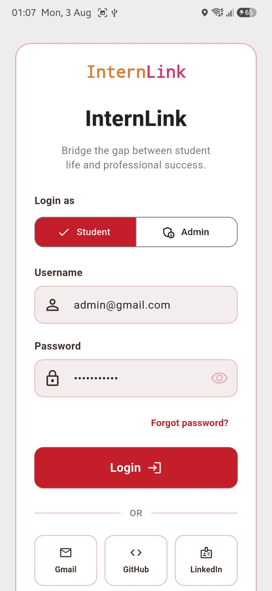 | 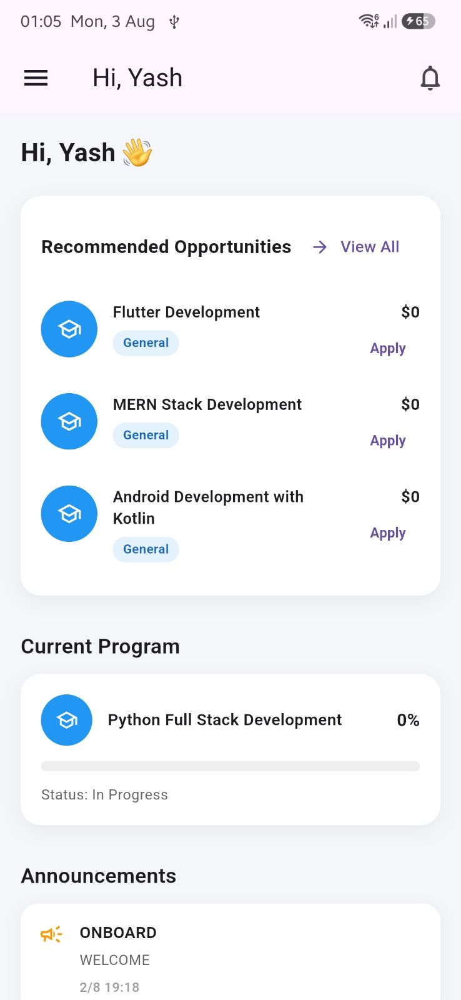 | 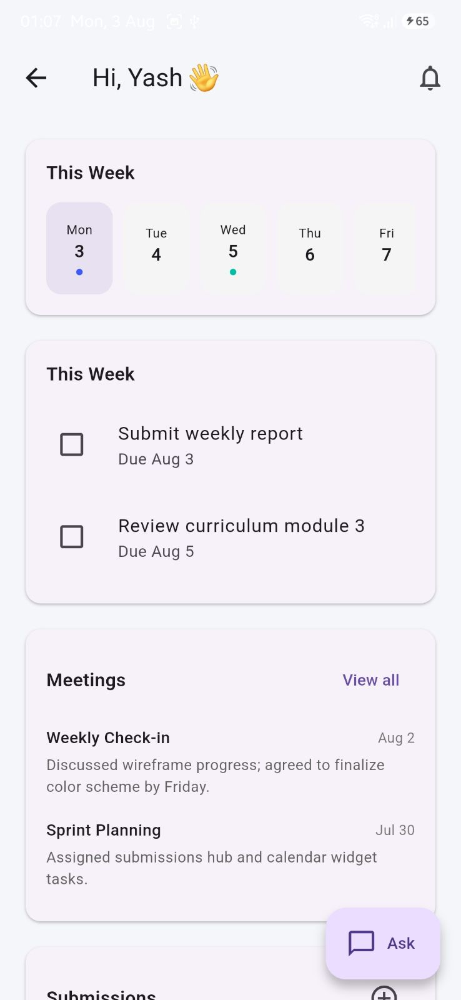 |

| Applied Programs | New Submission | Announcements |
|:---:|:---:|:---:|
| 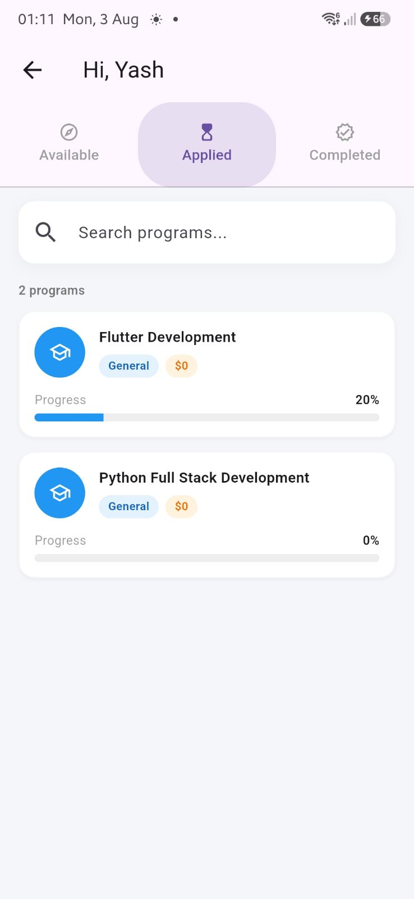 | 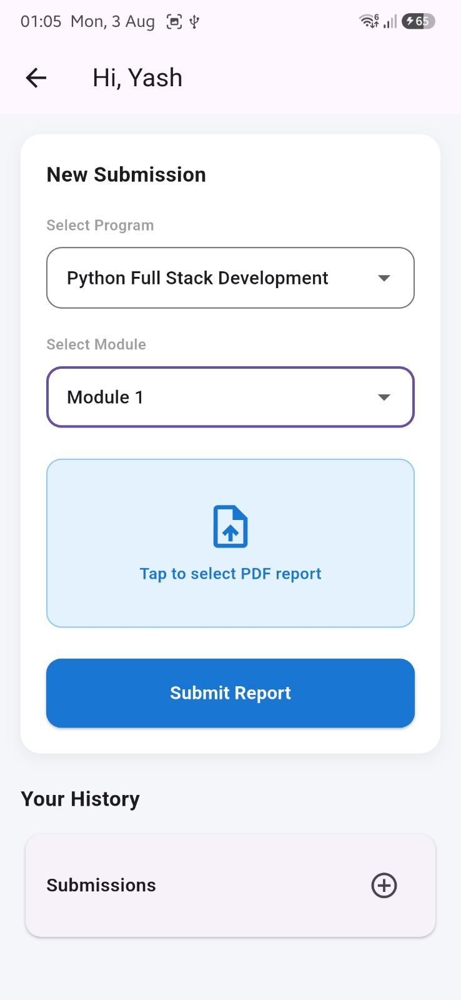 | 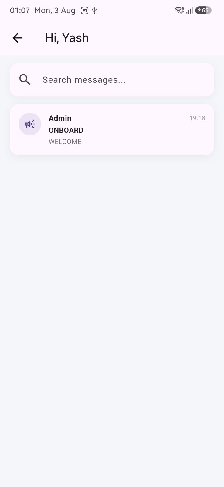 |

### Admin Panel

| AI Curriculum Generator | Broadcast Announcement |
|:---:|:---:|
| 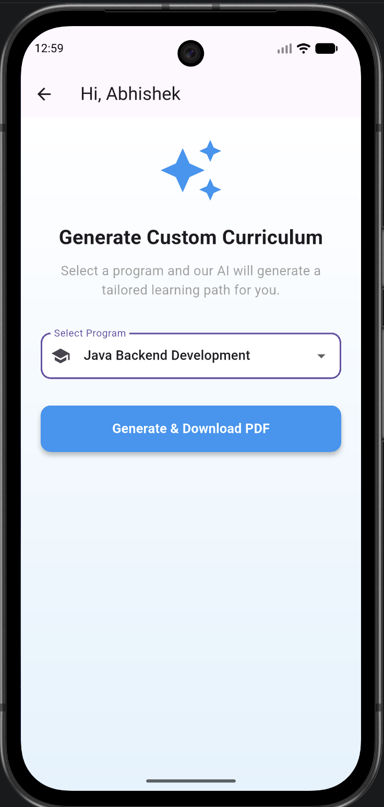 | 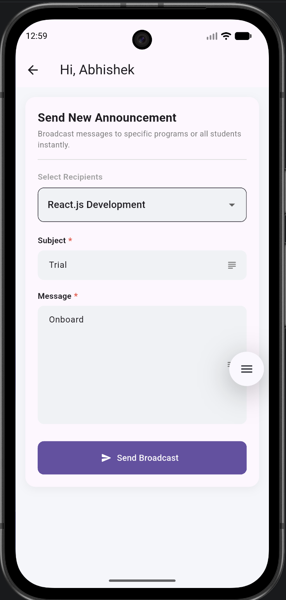 |

---

## ⚙️ Automation Workflows (n8n)

InternLink offloads AI generation, notifications, and error handling to **n8n**, keeping the app lightweight and reactive.

### 1. AI Curriculum Generation → PDF Export
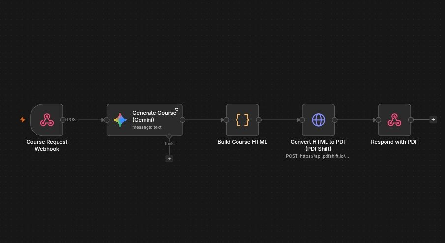

**Flow:** `Course Request Webhook → Generate Course (Gemini) → Build Course HTML → Convert HTML to PDF (PDFShift) → Respond with PDF`

- The app sends a `POST` request with the selected program to a webhook.
- **Gemini** generates a tailored curriculum based on the program.
- The generated content is assembled into HTML.
- **PDFShift** converts the HTML into a downloadable PDF.
- The final PDF is returned directly to the app for the admin/student to download.

### 2. Form Submission → Confirmation
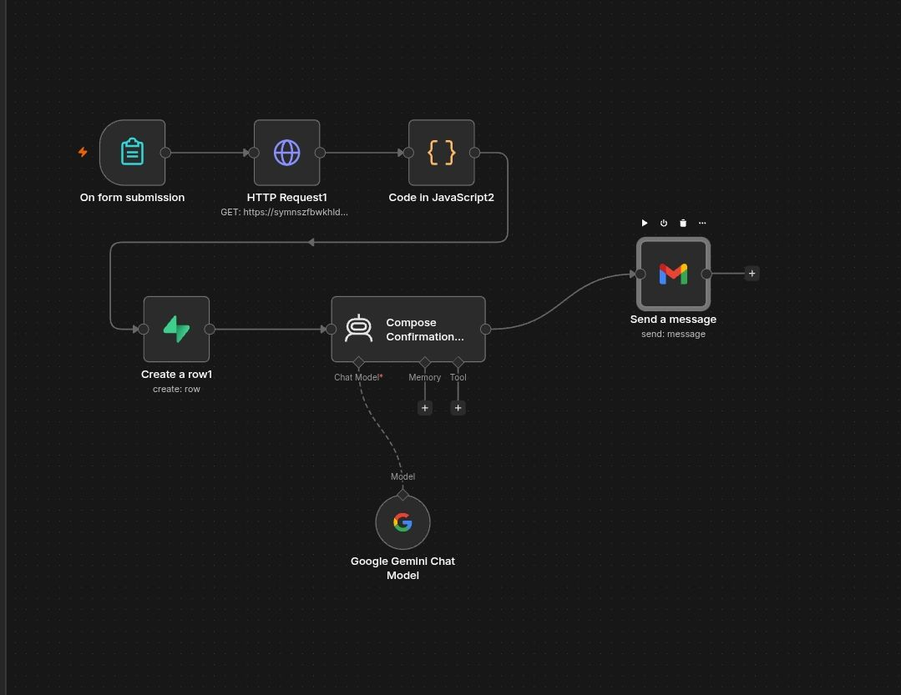

**Flow:** `On Form Submission → HTTP Request → Code (JavaScript) → Create Row (Sheet/DB) → Compose Confirmation (Gemini) → Send Message (Gmail)`

- Triggered whenever a form (e.g., a program/report submission) is submitted.
- Fetches supporting data via an HTTP request, then transforms it with a JavaScript code node.
- Logs the submission as a new row in the connected sheet/database.
- **Gemini** composes a personalized confirmation message.
- The confirmation is emailed to the student via Gmail.

### 3. Global Error Handling
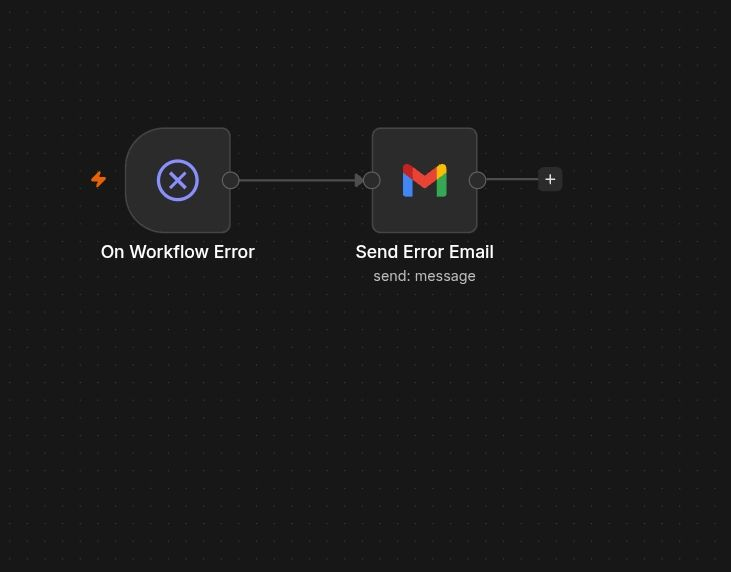

**Flow:** `On Workflow Error → Send Error Email`

- A dedicated error-trigger workflow catches failures from any other workflow in the instance.
- Sends an email alert so failures (e.g., a failed PDF conversion or API timeout) are caught and resolved quickly.

---

## 🛠️ Tech Stack

- **Frontend:** Flutter (Dart) — cross-platform mobile app for both Student and Admin panels
- **Automation / Backend workflows:** n8n
- **AI:** Google Gemini (curriculum generation, confirmation message composition)
- **PDF Generation:** PDFShift
- **Notifications:** Gmail (via n8n)

---

## 🚀 Getting Started

### Prerequisites
- [Flutter SDK](https://docs.flutter.dev/get-started/install) installed and configured
- Android Studio / Xcode (for emulators) or a physical device
- An n8n instance (self-hosted or [n8n Cloud](https://n8n.io)) with the workflows above imported
- API keys/credentials for Gemini, PDFShift, and Gmail configured in your n8n credentials

### Installation

```bash
# Clone the repository
git clone https://github.com/<your-username>/internlink.git
cd internlink

# Install dependencies
flutter pub get

# Run the app
flutter run
```

### Configuration
1. Point the app's API base URL to your n8n webhook endpoints (see `lib/config/` or your environment file).
2. Import the three workflow files into your n8n instance and activate them.
3. Add your Gemini, PDFShift, and Gmail credentials inside n8n.

---

## 📌 Roadmap
- [ ] Push notifications for announcements
- [ ] In-app grading/feedback on submissions
- [ ] Admin analytics dashboard

---

## 📄 License
This project is licensed under the MIT License — feel free to use and adapt it.
